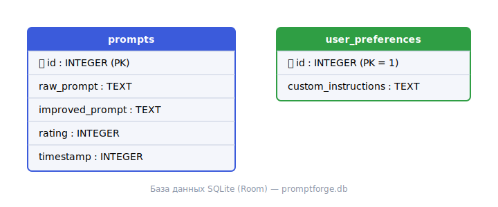
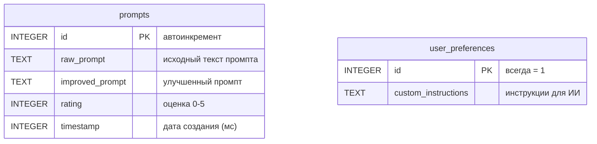

# Схема базы данных

[← На главную](index.html)

Приложение использует локальную базу данных **SQLite** через библиотеку **Room**.
Файл базы: `promptforge.db`. Версия схемы — 1.

## Схема

Та же схема в виде ER-диаграммы:

## Описание таблиц

### Таблица `prompts` — история промптов

| Поле | Тип | Описание |
|------|-----|----------|
| `id` | INTEGER, PK | Уникальный идентификатор, автоинкремент. |
| `raw_prompt` | TEXT | Исходный черновой текст, введённый пользователем. |
| `improved_prompt` | TEXT | Сгенерированный улучшенный промпт. |
| `rating` | INTEGER | Оценка результата пользователем (0 — не оценён, 1–5). |
| `timestamp` | INTEGER | Дата и время создания (Unix-время в миллисекундах). |

### Таблица `user_preferences` — профиль обучения

| Поле | Тип | Описание |
|------|-----|----------|
| `id` | INTEGER, PK | Первичный ключ, всегда равен 1 (одна запись). |
| `custom_instructions` | TEXT | Текущие инструкции для ИИ, обновляются после фидбека. |

## О связях

Таблицы не связаны внешним ключом: `prompts` хранит независимые записи истории,
а `user_preferences` — единственную запись с настройками генерации, которая
учитывается при каждом обращении к API. Связь логическая: предпочтения из
`user_preferences` влияют на то, какие промпты попадают в `prompts`.

## SQL-файл

Полный скрипт создания схемы: [schema.sql](schema.sql).

