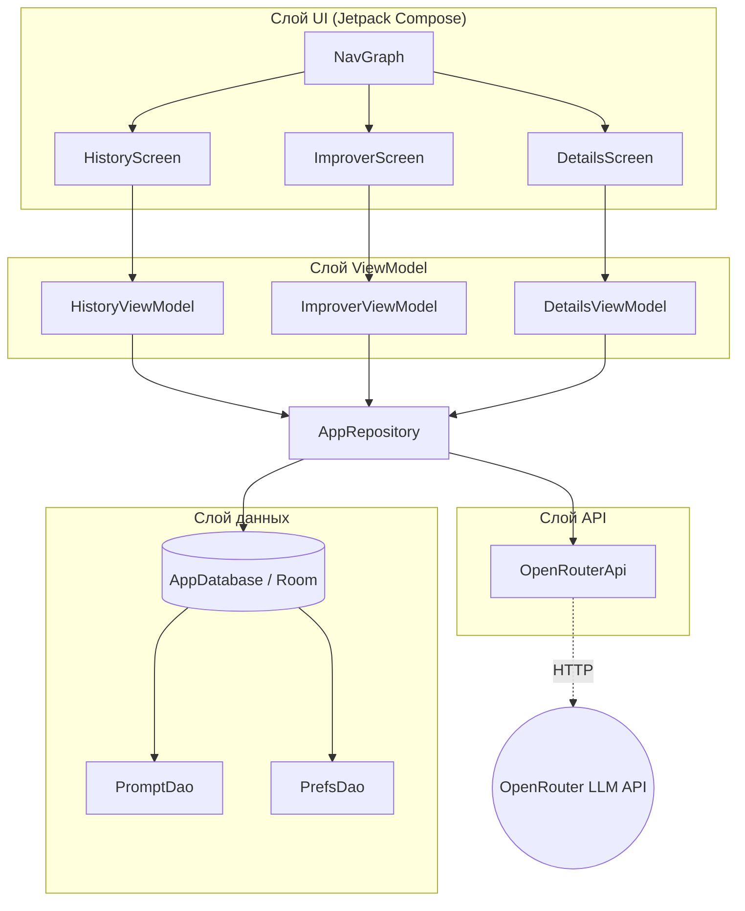

# Диаграмма файлов приложения

[← На главную](index.html)

## Структура файлов

```
pmvs11a-project-diva/
├── app/
│   ├── build.gradle.kts                  — конфигурация модуля и зависимости
│   └── src/main/
│       ├── AndroidManifest.xml           — манифест, разрешение INTERNET
│       ├── java/com/example/promptforge/
│       │   ├── MainActivity.kt           — точка входа, запускает NavGraph
│       │   ├── AppDatabase.kt            — конфигурация базы данных Room
│       │   │
│       │   ├── model/                    — сущности базы данных
│       │   │   ├── Prompt.kt             — Entity «prompts»
│       │   │   └── UserPreferences.kt    — Entity «user_preferences»
│       │   │
│       │   ├── dao/                      — объекты доступа к данным
│       │   │   ├── PromptDao.kt          — запросы к таблице prompts
│       │   │   └── PrefsDao.kt           — запросы к таблице user_preferences
│       │   │
│       │   ├── api/
│       │   │   └── GeminiApi.kt          — класс OpenRouterApi, вызовы LLM
│       │   │
│       │   ├── repository/
│       │   │   └── AppRepository.kt      — связывает БД и API
│       │   │
│       │   ├── viewmodel/                — состояние и логика экранов
│       │   │   ├── HistoryViewModel.kt
│       │   │   ├── ImproverViewModel.kt
│       │   │   └── DetailsViewModel.kt
│       │   │
│       │   └── ui/                       — экраны на Jetpack Compose
│       │       ├── NavGraph.kt           — навигация между экранами
│       │       ├── HistoryScreen.kt      — экран истории
│       │       ├── ImproverScreen.kt     — экран генератора
│       │       └── DetailsScreen.kt      — экран деталей
│       └── res/                          — ресурсы (строки, цвета, иконки)
└── build.gradle.kts                      — конфигурация проекта
```

## Диаграмма зависимостей слоёв



## Описание слоёв архитектуры

Приложение построено по принципу **MVVM** (Model–View–ViewModel) и разделено
на чёткие слои.

### Слой UI (`ui/`)

Экраны на Jetpack Compose. Не содержат бизнес-логики — только отображают
состояние из ViewModel и передают действия пользователя обратно.
`NavGraph.kt` отвечает за навигацию между тремя экранами.

### Слой ViewModel (`viewmodel/`)

Хранит состояние экранов и обрабатывает действия пользователя. Запускает
асинхронные операции в `viewModelScope` (корутины), чтобы не блокировать
UI-поток. Получает данные только через `AppRepository`.

### Слой репозитория (`repository/`)

`AppRepository` — единая точка доступа к данным. Скрывает от ViewModel детали
того, откуда берутся данные: из локальной базы или из сети. Сетевые вызовы
выполняются на `Dispatchers.IO`.

### Слой данных (`model/`, `dao/`, `AppDatabase.kt`)

Локальное хранилище на базе Room (SQLite). `model/` — сущности таблиц,
`dao/` — интерфейсы с SQL-запросами, `AppDatabase` — конфигурация базы.

### Слой API (`api/`)

`OpenRouterApi` (файл `GeminiApi.kt`) выполняет HTTP-запросы к внешнему
LLM-API через OkHttp: генерация уточняющих вопросов, генерация финального
промпта и обновление пользовательских инструкций.

<script type="module">
  import mermaid from 'https://cdn.jsdelivr.net/npm/mermaid@11/dist/mermaid.esm.min.mjs';
  document.querySelectorAll('code.language-mermaid').forEach(function (el) {
    var pre = el.parentElement;
    var div = document.createElement('div');
    div.className = 'mermaid';
    div.textContent = el.textContent;
    pre.replaceWith(div);
  });
  mermaid.initialize({ startOnLoad: true });
</script>
