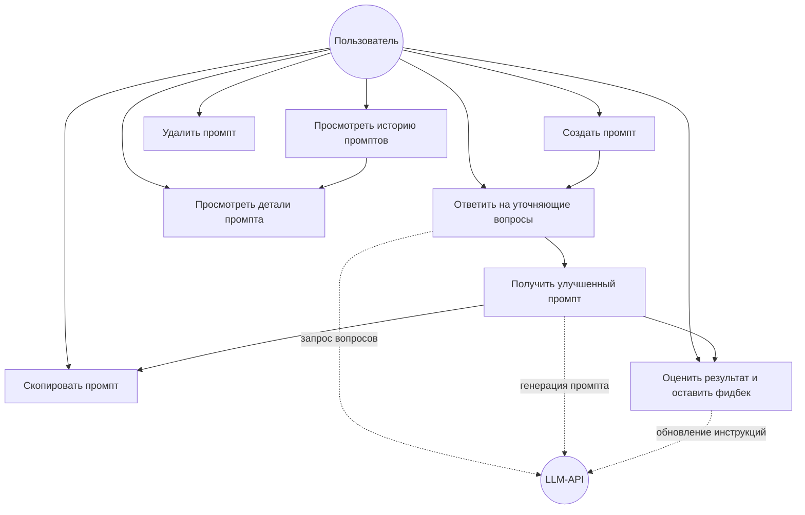

# Функциональные требования

[← На главную](index.html)

## Описание функциональных требований

| №    | Требование |
|------|------------|
| ФТ-1 | Пользователь может ввести черновой текст промпта и запустить его улучшение. |
| ФТ-2 | Приложение получает от LLM-API 2–3 уточняющих вопроса и показывает варианты ответов в виде кнопок. |
| ФТ-3 | Пользователь отвечает на вопросы выбором одного варианта (один клик = один ответ). |
| ФТ-4 | На основе чернового промпта и ответов приложение генерирует финальный улучшенный промпт. |
| ФТ-5 | Улучшенный промпт можно скопировать в буфер обмена. |
| ФТ-6 | Пользователь может оценить результат от 1 до 5 и оставить текстовый комментарий. |
| ФТ-7 | Промпт (исходный, улучшенный, оценка, дата) сохраняется в локальную базу данных. |
| ФТ-8 | На главном экране отображается история всех сохранённых промптов, отсортированная по дате. |
| ФТ-9 | Пользователь может открыть детали любого промпта из истории. |
| ФТ-10 | Пользователь может удалить промпт из истории (с подтверждением). |
| ФТ-11 | Комментарий пользователя обновляет инструкции для ИИ — приложение учитывает их при следующих генерациях. |

## Диаграмма Use Case

## Текстовые сценарии

### Сценарий 1. Создание и улучшение промпта

**Действующее лицо:** пользователь.
**Предусловие:** приложение запущено, открыт главный экран.

1. Пользователь нажимает кнопку **+** на главном экране.
2. Открывается экран генератора с полем ввода.
3. Пользователь вводит черновой промпт и нажимает **Improve**.
4. Приложение показывает индикатор загрузки и отправляет запрос к LLM-API.
5. Приложение получает 2–3 вопроса и показывает их по одному с вариантами-кнопками.
6. Пользователь по очереди выбирает ответ на каждый вопрос.
7. После последнего ответа приложение отправляет второй запрос и генерирует
   улучшенный промпт.
8. Улучшенный промпт отображается на экране.

**Постусловие:** сгенерирован улучшенный промпт, доступны копирование и оценка.

**Альтернативный поток A4:** при ошибке сети приложение показывает сообщение об
ошибке, пользователь может повторить попытку.

### Сценарий 2. Оценка результата и сохранение

**Предусловие:** улучшенный промпт сгенерирован.

1. Пользователь нажимает **Copy**, чтобы скопировать промпт (необязательно).
2. Пользователь выставляет оценку от 1 до 5 звёзд.
3. При желании пользователь пишет комментарий (например, «слишком длинно»).
4. Пользователь нажимает **Save**.
5. Приложение сохраняет промпт в базу данных.
6. Если был комментарий — в фоне отправляется запрос на обновление инструкций ИИ.
7. Приложение возвращается на главный экран, новый промпт появляется в истории.

**Постусловие:** промпт сохранён, история обновлена.

### Сценарий 3. Просмотр и удаление истории

**Предусловие:** в истории есть хотя бы один промпт.

1. Пользователь видит список промптов на главном экране.
2. Нажатие на элемент открывает экран деталей: исходный текст, улучшенный
   текст, дата, оценка.
3. Для удаления пользователь нажимает иконку корзины у нужного промпта.
4. Приложение показывает диалог подтверждения.
5. После подтверждения промпт удаляется из базы и списка.

**Постусловие:** выбранный промпт удалён из истории.

